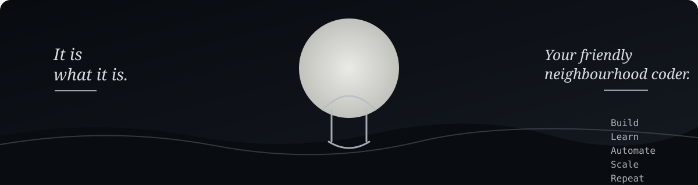

<div align="center">



# Hey, I'm Saksham.

**Software Engineer · AI Builder · Backend & Data Engineering**

*It is what it is.*  ·  *Your friendly neighbourhood coder.*

</div>

---

## About me

I build intelligent systems, automate boring stuff, and turn ideas into real-world software.

| | | |
|---|---|---|
| **AI / ML** | **Backend** | **Data Engineering** |
| LLMs · RAG · Automation | Python · FastAPI · Redis | SQL · PostgreSQL · ETL |

> **Same person. Bigger dreams.**

---

## Tech stack

`Python` · `FastAPI` · `SQL` · `PostgreSQL` · `Redis` · `Docker` · `Linux` · `Git` · `GitHub` · `Pandas` · `NumPy` · `LLMs` · `RAG`

---

## Featured projects

| Project | What it is | Stack |
|---|---|---|
| **Nexus** | Local-first personal AI assistant | Python · FastAPI · LLM |
| **RetailPlus** | Production-grade e-commerce analytics platform | Python · SQL · PostgreSQL |
| **Redis Project** | Hands-on Redis and backend systems | Python · Redis |
| **Online Auction** | Full-stack auction application | Python · Flask · Database |
| **Telegram Management Bot** | Automation bot for Telegram | Python · Telegram API |
| **Image Colouriser** | AI-based image colourisation | Python · OpenCV · AI |

---

## GitHub activity

<div align="center">


&nbsp;&nbsp;


<br/>


</div>

---

## Currently

```text
Building     → AI + Automation + Backend Systems
Learning     → System Design + SQL + Distributed Systems
Practicing   → Data Structures & Algorithms
Improving   → Engineering + Product + Communication
```

---

<div align="center">

*Build quietly. Learn constantly. Let the work speak.*

**Build · Learn · Ship · Repeat**

</div>